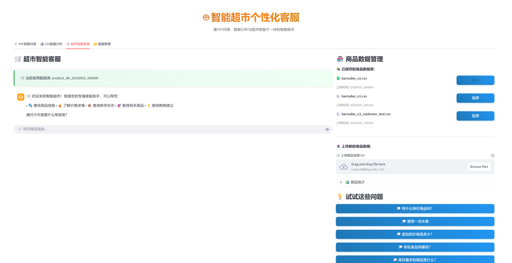
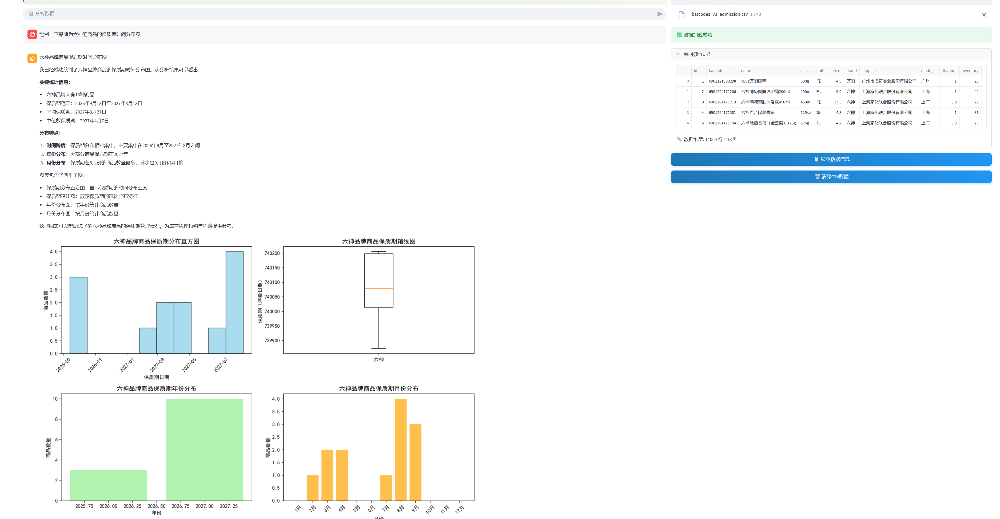
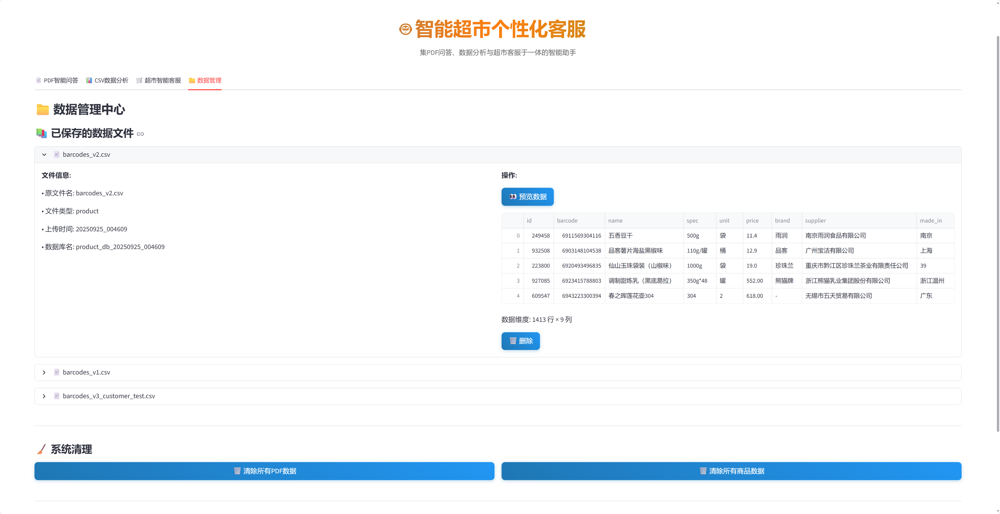

## Supermarket_Agent

一个基于 RAG 的超市智能助手，集「PDF 问答」「CSV 数据分析」「超市客服检索与推荐」「数据与向量库管理」于一体，支持快速部署使用。

### 主要特性

1. 智能客服（RAG）：挂载商品向量数据库，支持多轮对话，回答折扣、库存、品牌、位置、保质期等问题，理解模糊需求并给出相关推荐。支持 CSV、PDF 数据导入。
2. 数据分析 Agent：可端到端生成并执行 Python 代码进行分析与可视化，适合超市管理员对商品数据进行探索与报表制作。
3. 持久化向量库与文件管理：对上传数据进行哈希去重，新数据自动构建向量库并长期保存；支持预览、删除、快速切换多个数据库。

### 安装与运行

1. 安装依赖
   
   ```bash
   pip install -r requirements.txt
   ```
2. 配置环境变量（编辑项目根目录下的 `.env`文件）
   
   ```env
   DEEPSEEK_API_KEY=你的deepseek密钥
   DASHSCOPE_API_KEY=你的dashscope密钥
   ```
   
   - 本项目默认使用 deepseek 提供的 LLM 与阿里 DashScope 的 Embedding 服务。
   - 获取 deepseek API: `https://platform.deepseek.com/usage`
   - 获取 DashScope API: `https://bailian.console.aliyun.com/?tab=model#/api-key`
3. 启动应用
   
   ```bash
   streamlit run supermarket_agent.py
   ```

### 页面预览

采用 Streamlit 实现前端交互。以下为主要页面截图：







### 目录结构摘要

- `data/`：示例与处理后的数据集
- `data_backup/`：持久化存储区（上传文件与向量数据库）
  - `data_backup/saved_files/`：保存原始上传的 CSV 文件
  - `data_backup/db/`：保存对应的向量数据库（按时间戳命名）
- `history/`：历史版本脚本
- `photo/`：项目截图
- `supermarket_agent.py`：主应用入口

### 数据集与说明

- 原始实验数据下载地址：`https://gitee.com/EricLiuCN/barcode`
- 处理后数据均位于 `data/` 目录下：
  
  - `data/barcodes_v1.csv`：去除不必要列，清洗 `brand` 为空的值；数据量 14135，9 列。
  - `data/barcodes_v2.csv`：测试数据，从 v1 中随机抽取；数据量 1414，9 列。
  - `data/barcodes_v3_admission.csv`：在 v1 基础上更新：
    
    1) 清洗 `brand` 中不正常值（如 "-"）
    2) 将 `price` 由 object 转为 float，提高查询效率
    3) 新增列 `discount`、`inventory`、`expiration`、`product_location`（均为随机生成，用于测试）
       - discount：10% 为 0.9，5% 为 0.8，1% 为 0.7，其余为 1
       - inventory：20-50
       - expiration：2026-09-01 至 2027-09-30
       - product_location：A-H 区域
         数据量 14065 行，13 列。
    
    - 推荐用于管理员侧的数据分析功能。
  - `data/barcodes_v3_customer.csv`：在 admission 版基础上移除 `barcode`、`supplier`、`madein` 三列，更贴近顾客检索体验，适用于构建面向顾客的 RAG 数据库。

### 版本记录

- v1：基础功能实现
- v1.1：修复「快速询问按钮」导致的询问-回复异常
- v1.1.1：特别版本，尝试本地 Embedding（正式版仍采用 DashScope 云端 Embedding）
- v1.2：向量库持久化与哈希去重，减少重复向量化
- v1.3：统一数据管理至 `data_backup/`，CSV 于 `data_backup/saved_files/`，向量库于 `data_backup/db/`，按时间戳命名

### 致谢（Co-worker）

- 余子轩
- 姜睿哲

